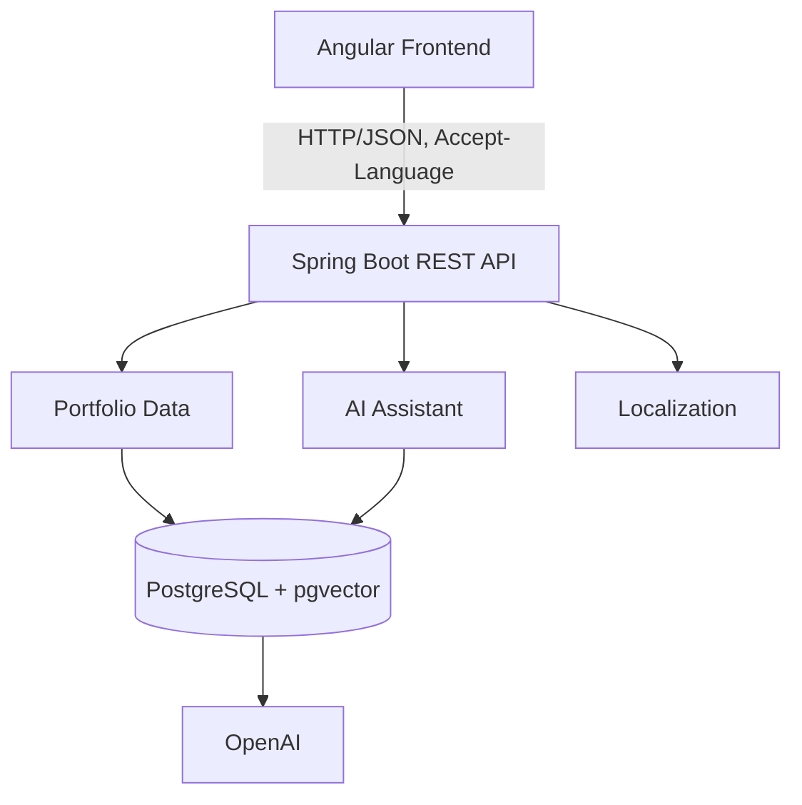

<div align="center">

# Daniel Bartholdy — Portfolio

**An AI-powered, multilingual developer portfolio built with Angular, backed by a Spring Boot API using Retrieval-Augmented Generation (RAG).**

[](https://angular.dev)
[](https://www.typescriptlang.org/)
[](https://spring.io/projects/spring-boot)
[](https://www.postgresql.org/)
[](https://vitest.dev)
[](https://bartholdy-portfolio.vercel.app)
[](#license)

[Live Demo](https://bartholdy-portfolio.vercel.app) · [Backend Repository](#backend-repository) · [Report an Issue](https://github.com/dhbart/bartholdy-portfolio/issues)

</div>

---

## Screenshots

| Home | Projects |
| ---  | --- |
|  |  |

| AI Assistant | Dark Theme |
| ---  | --- |
|  |  |


## Live Demo

🔗 **[danielhbartholdy-portfolio.vercel.app](https://danielhbartholdy-portfolio.vercel.app)**

Deployed on Vercel (frontend) + Render (backend API). Cold starts on the free-tier API can take a few seconds on first load.

---

## Why this project?

Instead of building another static developer portfolio, I wanted to build one that can actually **answer questions** about my professional experience.

The Angular frontend consumes a Spring Boot backend that exposes structured portfolio data (hero, about, experience, projects, certifications, technologies, social links) and an **AI Assistant** powered by Retrieval-Augmented Generation.

The result is an interactive portfolio where a recruiter — or anyone — can ask things like:

- "Tell me about Daniel's experience with Spring Boot."
- "Which ERP systems has he worked with?"
- "Has he ever led teams?"
- "What were his biggest projects?"

instead of scanning a resume PDF for the same answers.

## About the project

This portfolio was originally of a hands-on Angular challenge during a Java + Angular immersion, then rebuilt from the ground up with original content, layout, architecture and — later — its own backend.

No section is hardcoded into a template. Hero, About, Experience, Projects, Certifications, Technologies and Contact are all served by a dedicated REST API and rendered through strongly-typed data models, so the whole portfolio can evolve without touching component logic.

## Features

- **Hero & About** — quick introduction and personal summary, served by the API
- **Experience** — timeline-style history of professional roles, with detailed descriptions and highlights
- **Projects** — a grid of featured projects with dedicated detail pages, pulled from real GitHub repositories
- **Certifications** — degrees, MBA, bootcamps, courses and certifications, grouped by type
- **AI Assistant** — a conversational, RAG-based assistant that answers questions about Daniel's background (see below)
- **Multilingual** — Portuguese, English and Spanish, driven by `Accept-Language` end-to-end (API + UI)
- **Light / Dark theme**
- Fully responsive layout, built mobile-first
- Component-based architecture with reusable, typed data models
- Centralized SEO metadata (Open Graph, Twitter Cards, canonical URLs, per-route localization)

## AI Assistant

The floating assistant is not a static FAQ or a hardcoded chatbot — it's a conversational interface backed by a real retrieval pipeline:

- **Conversational** — draggable floating launcher, centered chat modal, Markdown-rendered answers with code highlighting
- **Retrieval-Augmented Generation (RAG)** — answers are grounded in a knowledge base about Daniel's experience, projects and skills, rather than relying on the model's raw parametric knowledge
- **Semantic search** — relevant context is retrieved via vector similarity instead of keyword matching
- **Multilingual** — responds in Portuguese, English or Spanish, in sync with the active locale
- **Context-aware** — keeps in-memory conversation history for natural follow-up questions
- **Scoped by design** — the assistant is instructed to answer questions about Daniel's career, projects and skills, and to decline unrelated general-knowledge questions
- **Powered by Spring AI, OpenAI and PostgreSQL + pgvector** on the backend

The frontend only knows a single contract — `POST /api/v1/assistant/chat` — so the retrieval and generation strategy can evolve behind that boundary without any UI changes.

> The backend implementation details (ingestion, embeddings, prompt strategy) live in the [API repository](#backend-repository) and are intentionally out of scope here.

## Architecture

```
                 ┌───────────────────────┐
                 │        Angular        │
                 │   (this repository)   │
                 └───────────┬───────────┘
                             │ HTTP/JSON · Accept-Language
                             ▼
                 ┌───────────────────────┐
                 │  Spring Boot REST API │
                 │     (portfolio-api)   │
                 └────────────┬──────────┘
                              │
        ┌─────────────────────┼─────────────────────┐
        ▼                     ▼                     ▼
┌─────────────────┐   ┌────────────────────┐   ┌──────────────────┐
│ Portfolio Data  │   │   AI Assistant     │   │  Localization    │
│ Hero / About /  │   │   RAG pipeline     │   │  Accept-Language │
│ Projects / etc. │   │                    │   │  pt-BR / en-US / │
│                 │   │                    │   │  es-ES           │
└───────┬─────────┘   └─────────┬──────────┘   └──────────────────┘
        │                       │
        ▼                       ▼
┌────────────────────────────────────┐
│      PostgreSQL + pgvector         │
└──────────────────┬─────────────────┘
                   ▼
             ┌─────────────┐
             │   OpenAI    │
             └─────────────┘
```



This repository owns the presentation layer only. The API is the single source of truth for portfolio content — no business data is hardcoded in Angular.

## Tech Stack

### Frontend

- Angular 22 (standalone components, new control-flow syntax)
- TypeScript (strict mode)
- SCSS, with a token-based theming system (light/dark)
- Angular Signals & the Resource API for HTTP reads
- Angular CDK (focus trapping, accessibility primitives)
- Vitest for unit and integration tests
- Angular CLI, Prettier

### Backend

- Spring Boot
- Spring AI
- PostgreSQL
- Supabase
- pgvector

### AI

- OpenAI
- Retrieval-Augmented Generation (RAG)
- Semantic search / vector similarity

## Project Structure

```
src/app/
├── core/                 # Cross-cutting concerns
│   ├── api/              # HTTP client boundary (ApiService)
│   ├── config/           # App-wide configuration
│   ├── i18n/             # Translation catalog
│   ├── interceptors/     # Accept-Language, error handling
│   ├── models/           # Shared transport models
│   ├── seo/              # SeoService (Title/Meta, Open Graph, canonical)
│   └── services/         # LocaleService, LoadingService, ThemeService, ...
├── features/             # One folder per portfolio section
│   ├── hero/
│   ├── about/
│   ├── experience/
│   ├── projects/
│   ├── certifications/
│   └── social-links/
├── pages/                # Route-level pages
│   ├── home/
│   ├── project-details/
│   ├── certification-details/
│   └── not-found/
├── shared/
│   └── components/       # header, footer, assistant, technology-badge, detail/*
├── environments/         # API base URL per environment
├── app.routes.ts
└── app.config.ts
```

Each `features/*` folder owns its own service, models and presentation components, following the reference implementation established by `hero`. `shared/components/detail/*` provides the reusable presentation primitives (headers, metadata grids, technology badges, empty/loading states) used by every detail page.

## Getting Started

### Prerequisites

- [Node.js](https://nodejs.org/) (LTS recommended)
- npm
- A running instance of the [backend API](#backend-repository) (or point `apiUrl` at the deployed one)

### Installation

```bash
git clone https://github.com/dhbart/bartholdy-portfolio.git
cd bartholdy-portfolio
npm install
```

## Environment Variables

The API base URL is centralized in the Angular environment files and is never hardcoded in components or services.

| Variable | Used in | Purpose |
| --- | --- | --- |
| `API_URL` | `npm run build` (via `scripts/generate-environment.mjs`) | Generates `src/environments/environment.prod.ts` with the production API URL before compiling |

- **Local development** uses `src/environments/environment.ts`, pointing to `/api/v1` (proxied — see below).
- **Production** builds require `API_URL` to be set in the shell (or in Vercel's Project Settings → Environment Variables) before `npm run build` runs.

During local development, `proxy.conf.json` forwards `/api/**` and `/icons/**` to `http://localhost:8080`, keeping requests same-origin and avoiding CORS preflight failures — this matters in particular for the AI Assistant's `POST` requests.

## Development

```bash
npm start
```

Navigate to `http://localhost:4200/`. The app reloads automatically on file changes, and Angular's proxy forwards API calls to your local backend on port 8080.

## Production Build

```bash
# macOS / Linux
API_URL="https://your_backen_url/api/v1" npm run build

# Windows (PowerShell)
$env:API_URL = "https://your_backen_url/api/v1"
npm run build
```

This compiles the project and outputs production-ready artifacts to `dist/`. On Vercel, set `API_URL` under **Project Settings → Environment Variables**; it's picked up automatically during `npm run build` (see `vercel.json`).

SEO metadata (localized titles, descriptions, canonical URLs, Open Graph, Twitter Cards, document language) is centralized in `src/app/core/seo/seo.service.ts` and applied per route. `public/robots.txt`, `public/sitemap.xml`, `public/manifest.webmanifest` and `public/favicon.ico` are copied to the production output as-is.

## Testing

```bash
npm test
```

Runs the Vitest suite. The frontend follows a testing pyramid: fast unit tests for deterministic core behavior, boundary tests for HTTP and interceptors (via Angular's `HttpTestingController`), and component/resource/routing tests for user-visible behavior — asserting rendered states, signals, requests, navigation contracts and accessibility semantics rather than snapshotting templates.

Coverage is risk-based: every public core service and HTTP boundary is tested, every route contract and critical resource state is covered, and representative components verify i18n, theming, SEO and keyboard/focus accessibility.

## Roadmap

- [x] AI Assistant frontend integration (draggable launcher, chat modal, Markdown rendering)
- [x] Full multilingual support (pt-BR, en-US, es-ES) across UI and API
- [x] Light / dark theme
- [x] Angular Resource API migration for all HTTP reads
- [x] Accessibility hardening (focus trapping, skip links, ARIA)
- [x] End-to-end tests for the AI Assistant flow
- [ ] Admin panel for managing portfolio content without redeploying

See the backend repository for the RAG pipeline and administrative-panel roadmap.

## Backend Repository

This repository is frontend-only. Portfolio content, localization and the AI Assistant are served by a separate Spring Boot API:

🔗 **[portfolio-api](https://github.com/dhbart/portfolio-api)** — REST API, PostgreSQL + pgvector, RAG pipeline, Flyway migrations

> Update this link if the backend repository name or visibility changes.

## License

This project is licensed under the [MIT License](LICENSE).

## Contact

- **Author:** [Daniel Henrique Bartholdy](https://linkedin.com/in/daniel-bartholdy)
- **LinkedIn:** [linkedin.com/in/daniel-bartholdy](https://linkedin.com/in/daniel-bartholdy)
- **GitHub:** [github.com/dhbart](https://github.com/dhbart)

---

<div align="center">

Based on the base project from the DIO Bootcamp Java + Angular immersion.

</div>
